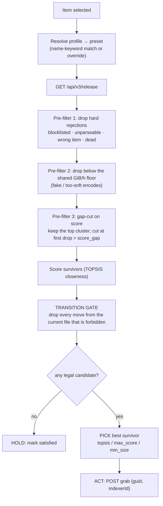
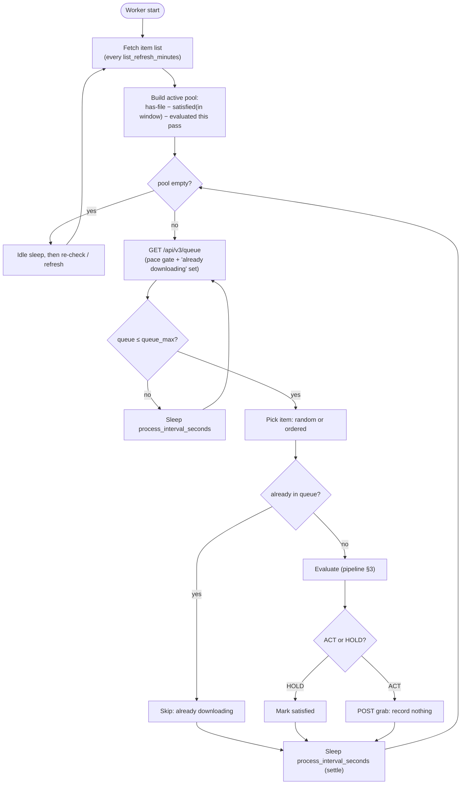
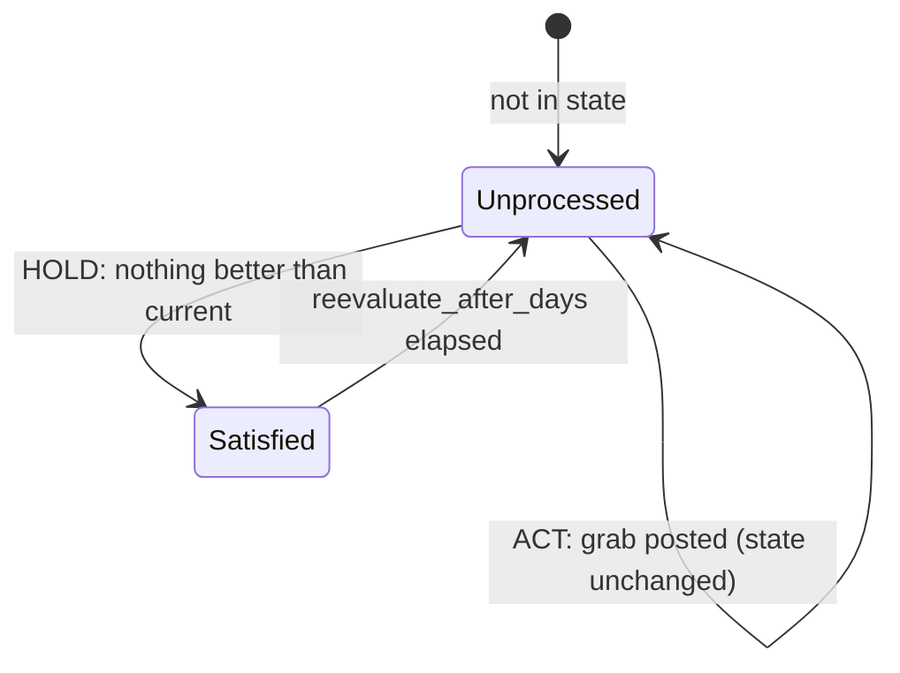

# How Optimizarr decides

This is the in-depth companion to the [README](README.md): the selection algorithm, the guard
rails, the TOPSIS math, the configuration model, and the worker loop. For the *why* behind the
design (and the validation roadmap), see
[docs/condition-matrix-design.md](docs/condition-matrix-design.md).

The optimizer evaluates the releases available for one library item, decides whether a better
one exists, and grabs it through Radarr/Sonarr. It is built around the reality that **grabbed
releases frequently fail to download**, so *"optimized"* means *the algorithm can no longer find
anything better than the current file*, never merely *"we triggered a grab."*

There are two big ideas:

- **A two-part selection**: a **transition gate** decides which moves from the current file are
  even *legal* (hard rules, some universal, some per-profile), and only then does **TOPSIS** (or
  a deterministic pick) choose the best among the survivors. Legality first, taste second.
- **A two-layer size model**: one **shared, objective size reference** per resolution, plus a
  **relative aim** per profile. Profiles never carry absolute sizes, and the size curve is
  **one-sided** so a file is never inflated to "reach" a target.

---

## 1. The size model: one shared reference, relative aims

`[optimizer.topsis.reference]` defines, per resolution, a realistic GiB/h band, shared by every
profile (`GB = 1024³`, so GiB):

| resolution | floor | target | ceiling |
| --- | --- | --- | --- |
| 2160 | 3.0 | 6.5 | 18 |
| 1080 | 1.0 | 2.5 | 8 |
| 720 | 0.4 | 1.0 | 4 |
| 480 | 0.2 | 0.5 | 3 |

- **floor**: below this the encode is fake / too soft for the resolution → dropped before
  scoring (the only place size can veto a release).
- **target**: what a *good* (HDR-assumed, lean) release actually weighs at this resolution.
- **ceiling**: above this is bloat; size desirability reaches 0.

Each profile only adds a relative **`size_aim`** (a fraction of `target`). Its size-desirability
curve is **one-sided**:

```
aim = size_aim × reference.target[resolution]

n_size(gbh) = 1.0                          if gbh ≤ aim          (plateau, smaller never punished)
            = (ceiling − gbh)/(ceiling − aim)   if aim < gbh < ceiling   (linear ramp down)
            = 0.0                          if gbh ≥ ceiling
```

Two consequences make this safe for a space-saving tool:

- **Nothing is ever inflated.** A file already at or below the aim scores `n_size = 1.0`, so
  TOPSIS has no reason to swap it for a bigger one. A tiny, good-scoring file stays.
- **Among files at/below the aim, size ties at 1.0 → score breaks the tie**, i.e. "small
  enough, then best score," which is exactly "good *and* small."

Worked aim points (`size_aim × target`):

| Profile | `size_aim` | aim @2160 | aim @1080 | intent |
| --- | --- | --- | --- | --- |
| Quality | 1.0 | 6.5 | 2.5 | at the realistic target |
| Balanced | 0.8 | 5.2 | 2.0 | slightly smaller |
| Efficient | 0.65 | 4.2 | 1.6 | much smaller |
| Compact | 0.5 | 3.25 | 1.25 | toward the floor |
| Remux | n/a | n/a | n/a | ignores size (weight ≈ 0) |

---

## 2. Scoring: TOPSIS over three axes

Each surviving release is described by three attributes, all normalized to `[0, 1]`:

```
n_score      = clamp( (score − score_anti_ideal) / (score_ideal − score_anti_ideal), 0, 1 )
n_resolution = clamp( (height − res_anti_ideal)  / (target_height − res_anti_ideal),  0, 1 )
n_size       = one-sided curve above
```

Score normalizes on a **fixed** scale (`[0, 1,000,000]` by default) so good releases stay
comparable across items. Resolution climbs toward the profile's target height (low weight on
purpose, since Profilarr already folds resolution into the score, so this axis mostly avoids
double-counting).

A profile's **weights** (summing to 1.0) combine the axes into a TOPSIS *closeness*, the distance
to the ideal point `(1,1,1)` vs the anti-ideal `(0,0,0)`:

```
d_ideal = √( Σ wₖ·(1 − aₖ)² )
d_anti  = √( Σ wₖ·aₖ² )
closeness = d_anti / (d_ideal + d_anti)        # 1 = ideal, 0 = anti-ideal
```

Shipped weights:

| Profile | score | resolution | size | pick method |
| --- | --- | --- | --- | --- |
| Remux | 0.80 | 0.15 | 0.05 | `max_score` |
| Quality | 0.65 | 0.15 | 0.20 | `topsis` |
| Balanced | 0.50 | 0.10 | 0.40 | `topsis` |
| Efficient | 0.40 | 0.10 | 0.50 | `topsis` |
| Compact | 0.20 | 0.10 | 0.70 | `min_size` |

`max_score` (Remux) and `min_size` (Compact) are deterministic single-axis picks; once the gate
has run, those profiles don't need a blend, and a deterministic sort is clearer and
oscillation-proof. The middle three balance score vs size, which is what TOPSIS is for.

---

## 3. The decision pipeline



Two app-policy pre-filters can run before scoring: `allow_size_increase = false` drops anything
bigger than the current file, and `allow_quality_downgrade = false` drops anything lower-scoring
(turning the latter off neutralizes the size-leaning profiles, which is the point of the flag).

There is **no `min_closeness_gain` threshold** anymore. A candidate that survives the gate is, by
construction, a legal and beneficial change, so the rule is simply: **ACT if a legal survivor
exists, else HOLD.** Closeness decides *which* survivor, not *whether* to act.

---

## 4. The transition gate (the guard rails)

The gate compares a candidate to the **current file** on three deltas and asks "is this move
allowed?" Magnitudes are bucketed on stable, fixed thresholds:

- **score**: on `Δn_score` (normalized): `same` within `score_slack` (0.02); `much_*` beyond
  `score_much` (0.10); `slightly_*` in between.
- **size**: on the *relative* GiB/h delta: `same` within `size_slack` (3%); `much_smaller`
  beyond `size_much` (30%).
- **resolution**: candidate height vs current height.

### Universal rules (every profile)

1. A **resolution downgrade** is never allowed.
2. A **resolution upgrade** waives the size rules (a higher-res file is expected to be bigger),
   allowed unless the score is *much* lower.
3. At equal resolution, a **bigger file with no score increase** is never allowed.

### Per-profile matrices (at equal resolution)

Generated from the rules in `transitions.py` (`✅` = legal move, `·` = forbidden). Rows are the
candidate's score vs current; columns its size vs current.

**Remux**: score is everything; never trades score for size:

| score＼size | much_smaller | smaller | same | bigger |
| --- | --- | --- | --- | --- |
| much higher | ✅ | ✅ | ✅ | ✅ |
| higher | ✅ | ✅ | ✅ | ✅ |
| same | ✅ | ✅ | · | · |
| slightly lower | · | · | · | · |
| much lower | · | · | · | · |

**Quality**: max score, mild size care (a slight score drop only buys a *much* smaller file; a
bigger file needs a *much* higher score):

| score＼size | much_smaller | smaller | same | bigger |
| --- | --- | --- | --- | --- |
| much higher | ✅ | ✅ | ✅ | ✅ |
| higher | ✅ | ✅ | ✅ | · |
| same | ✅ | ✅ | · | · |
| slightly lower | ✅ | · | · | · |
| much lower | · | · | · | · |

**Balanced / Efficient**: good score *and* smaller (they share this matrix; they differ only in
TOPSIS weights, where Balanced leans score, Efficient leans size):

| score＼size | much_smaller | smaller | same | bigger |
| --- | --- | --- | --- | --- |
| much higher | ✅ | ✅ | ✅ | ✅ |
| higher | ✅ | ✅ | ✅ | · |
| same | ✅ | ✅ | · | · |
| slightly lower | ✅ | ✅ | · | · |
| much lower | · | · | · | · |

**Compact**: smallest viable; **never a bigger file**, and a real score drop is OK only if the
file is *much* smaller and still above `viability_score`:

| score＼size | much_smaller | smaller | same | bigger |
| --- | --- | --- | --- | --- |
| much higher | ✅ | ✅ | ✅ | · |
| higher | ✅ | ✅ | ✅ | · |
| same | ✅ | ✅ | · | · |
| slightly lower | ✅ | ✅ | · | · |
| much lower | ✅ | · | · | · |

These come from a small set of per-profile flags (`accept_score_drop`,
`slight_drop_needs_much_smaller`, `allow_bigger_for_score`, `bigger_needs_much_score`,
`accept_much_lower_score`, `viability_score`); see the `[…transitions]` blocks in
`defaults.toml`.

### No oscillation, by construction

The accept relation is a **strict partial order**: if `A → B` is a legal improvement for a
profile, then `B → A` is forbidden for it, so two files can never ping-pong. This holds because
the thresholds are fixed (field-relativity lives only in the gap-cut pre-filter) and
`score_much > score_slack` / `size_much > size_slack` are **enforced at config load**. It is
checked in tests over 100k random pairs across all profiles.

---

## 5. Configuration model

Everything lives under `[optimizer.topsis]`, layered on `defaults.toml`:

```toml
[optimizer.topsis]
score_ideal = 1000000          # n_score scale …
score_anti_ideal = 0
resolution_ideal = 2160        # fallback target when a profile exposes no allowed resolution
resolution_anti_ideal = 480
score_gap = 0.20               # gap-cut: keep the top score cluster within this relative drop
default_preset = "Efficient"   # used when a profile name matches no preset keyword

[optimizer.topsis.reference]   # the one shared size table (see §1)
"2160" = { floor = 3.0, target = 6.5, ceiling = 18 }
# … 1080 / 720 / 480 …

[optimizer.topsis.presets.Efficient]
score = 0.40                   # weights (sum 1.0)
resolution = 0.10
size = 0.50
size_aim = 0.65                # fraction of reference target where n_size stops being 1.0
pick = "topsis"                # topsis | max_score | min_size
[optimizer.topsis.presets.Efficient.transitions]
# overrides of the gate flags (all optional; see defaults.toml for keys + defaults)
```

A Radarr/Sonarr profile attaches to the preset whose name is a case-insensitive **substring** of
the profile name (`2160p Quality` → Quality). Pin or customize an exact profile with
`[optimizer.topsis.profiles."<name>"]`, which may set `preset`, `weights`, `size_aim`, or `pick`
and inherits the shared reference. Validation at load time enforces weights-sum-to-1,
`0 < size_aim ≤ 1`, `floor < target ≤ ceiling`, a known `pick`, and the oscillation inequalities.

---

## 6. The worker loop

The optimizer is a continuous, interval-driven worker (the unmonitor job keeps its own cron).



- **One queue fetch per iteration** serves both the pace gate (`queue_max`) and the "already
  downloading?" skip, so there's **no in-flight state** to track and a restart needs no
  reconciliation.
- `process_interval_seconds` (default 15, min 10) doubles as a **settle delay**: after a grab,
  Radarr needs a moment to register the release in the queue before the next `queue_max` check.
- A grab **records nothing**. Each item is remembered for the current **pass** so it isn't
  re-picked; a list refresh updates the candidate set but doesn't restart the pass. When the pass
  is fully covered it resets.

### Per-item state lifecycle

State (`/data/state.json`, keyed by item id) records exactly one thing, whether an item is
**satisfied**, which is what makes failure handling self-correcting.



- A grab is **never recorded**. A grab that **succeeds** replaces the file; next evaluation finds
  nothing better → **satisfied** → leaves the pool. A grab that **fails** was never satisfied, so
  the item is retried, and by then the dead release is blocklisted, so pre-filter 1 drops it and
  the next-best candidate is picked. Repeated failures walk down the ranking until one sticks.
- A download **in progress** is skipped via live queue membership, never re-grabbed.

> **Dependency:** this relies on Radarr/Sonarr **Failed Download Handling** (default on) to
> blocklist dead releases. Without it, a failed grab wouldn't be de-prioritized next pass.

---

## 7. The Unmonitor job

A separate, cron-scheduled pass (`[unmonitor]`, default `0 4 * * *`) that **unmonitors** items so
the \*arr apps stop chasing upgrades off their RSS feeds just because newer releases appeared.

An item is unmonitored when **all** of these hold (`features/unmonitor/candidates.py`):

1. it is currently **monitored** (otherwise nothing to do);
2. it **has a file**: never unmonitor a wanted-but-undownloaded item (that would mean "give
   up"); only stop chasing *upgrades*;
3. if `require_cutoff_met = true`, its quality **cutoff is met** (don't stop early if it hasn't
   reached the target quality yet);
4. it is at least `days` old, measured against the configured `release_type` date
   (`digitalRelease` for Radarr, `airDateUtc` for Sonarr, by default).

This pairs naturally with the optimizer: the optimizer keeps improving files by `hasFile`
regardless of monitored state, while Unmonitor strips the monitoring that would otherwise have
Radarr/Sonarr fighting it with fresh RSS grabs.

---

*`dry_run = true` makes both features log every would-be action without changing anything.
`tools/weight_lab.py` renders how each profile scores and picks across sample releases.*
