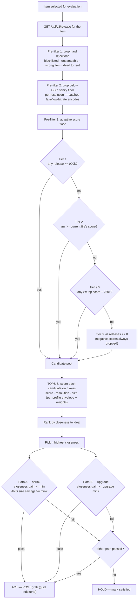
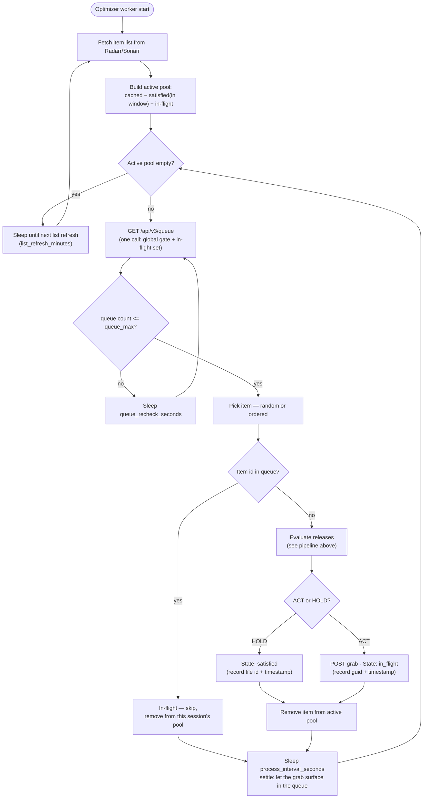
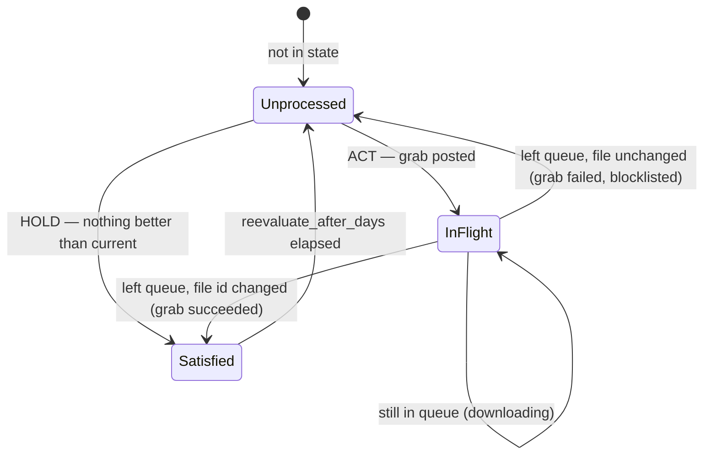

# Optimizarr — Optimizer Design

The optimizer evaluates the releases available for each library item, decides whether a
better one exists (smaller at equal quality, or a genuine quality upgrade), and grabs it
through Radarr/Sonarr. It is built around the reality that **grabbed releases frequently
fail to download** — so "optimized" means *the algorithm can no longer find anything
better than the current file*, never merely *we triggered a grab*.

This document describes two things:

1. **Release evaluation** — how a single item's candidate releases are filtered, scored,
   and turned into an ACT/HOLD decision.
2. **Worker loop** — the continuous, queue-gated process that walks the library, and the
   per-item state lifecycle that makes failure handling self-correcting.

---

## 1. Release evaluation pipeline

For one movie (or episode), this is how candidates become a decision.

### Pipeline notes

- The three pre-filters run in order; each only narrows the set. Tiers 1 → 2 → 2.5 → 3
  are tried in sequence and the **first non-empty tier wins** — so a clean library lands
  in Tier 1, a sparse search degrades gracefully, and negative-scored (Profilarr-banned)
  releases are never considered.
- TOPSIS weights and the size envelope (target/bloat GB/h) are **per profile**: a
  `2160p Quality` item is scored differently than `2160p Efficient`. Score dominates on
  Quality; size matters more on Efficient.
- Two independent gates lead to ACT. **Path A** is "keep quality, save real disk space."
  **Path B** is "materially better quality, size increase tolerated" (e.g. 1080p → 2160p).
  Either passing is enough.

---

## 2. Worker loop

The optimizer is a continuous interval-driven worker (not a cron pass). The unmonitor
feature keeps its own cron; the optimizer's cadence is governed by its own timers.

### Loop notes

- The **queue fetch sits at the top of each iteration**, *after* the settle sleep, so it
  always reflects the previous iteration's grab. One fetch serves both the global gate
  (`queue_max`) and the per-item in-flight check.
- `process_interval_seconds` (default 10) is a **settle delay**, not just pacing: after a
  `POST /api/v3/release`, Radarr needs a moment to hand the release to the download client
  and register it in the queue. Reading the queue too soon would miss the just-grabbed item.
- The active pool shrinks as items are processed and only grows on list refresh — this is
  what stops the worker from re-querying every item forever. Random pick draws from the
  active pool only, so optimized items are never re-picked.

---

## 3. Per-item state lifecycle

State lives in `/data/state.json`, keyed by movie id / episode id. The lifecycle is what
makes failed downloads self-correcting — no cooldown timer required.

### Why this self-corrects on failure

- A grab that **succeeds** replaces the file; on the next evaluation the algorithm sees a
  good current file and returns HOLD → the item becomes **satisfied**.
- A grab that **fails** is blocklisted by Radarr's Failed Download Handling. On the next
  evaluation, pre-filter 1 drops that blocklisted release, so TOPSIS picks the **next-best**
  candidate. Repeated failures simply walk down the ranking, one blocklisted release at a
  time, until one sticks (→ satisfied) or no viable candidate remains (HOLD → satisfied).
- In-flight is detected purely from queue membership, so an item mid-download is never
  re-grabbed.

> **Dependency:** this relies on Radarr/Sonarr **Failed Download Handling** being enabled
> (default on) so dead releases get blocklisted. Without it, a failed grab would not be
> de-prioritised on the next pass.
