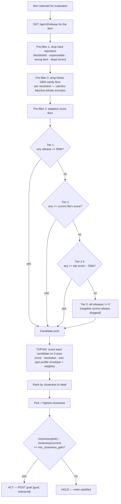
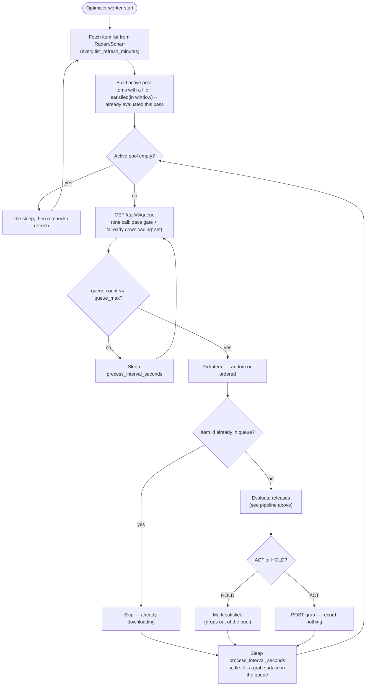
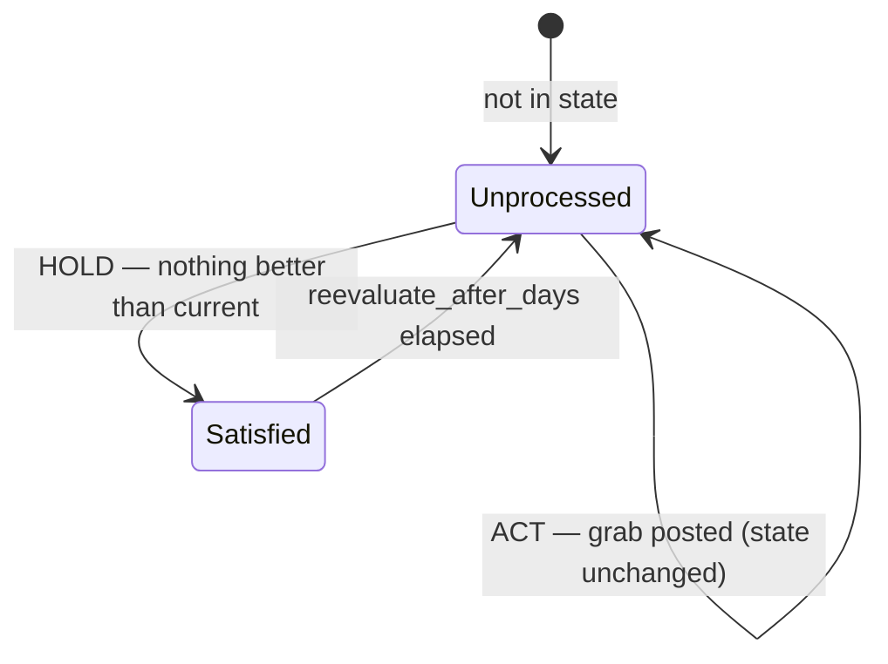

# Optimizarr — Optimizer Design

The optimizer evaluates the releases available for each library item, decides whether a
better one exists (smaller at equal quality, or a genuine quality upgrade), and grabs it
through Radarr/Sonarr. It is built around the reality that **grabbed releases frequently
fail to download** — so "optimized" means *the algorithm can no longer find anything
better than the current file*, never merely *we triggered a grab*.

This document describes two things:

1. **Release evaluation** — how a single item's candidate releases are filtered, scored,
   and turned into an ACT/HOLD decision.
2. **Worker loop** — the continuous, queue-gated process that walks the library, and the
   per-item state lifecycle that makes failure handling self-correcting.

---

## 1. Release evaluation pipeline

For one movie (or episode), this is how candidates become a decision.

### Pipeline notes

- The three pre-filters run in order; each only narrows the set. Tiers 1 → 2 → 2.5 → 3
  are tried in sequence and the **first non-empty tier wins** — so a clean library lands
  in Tier 1, a sparse search degrades gracefully, and negative-scored (Profilarr-banned)
  releases are never considered.
- TOPSIS weights and the size envelope (target/bloat GB/h) are **per profile**: a
  `2160p Quality` item is scored differently than `2160p Efficient`. Score dominates on
  Quality; size matters more on Efficient.
- The swap decision is a **single threshold**: grab iff the pick's closeness beats the
  current file's by at least `min_closeness_gain`. Because closeness already folds in score,
  resolution, and size (via the per-profile envelope + weights), that one check naturally
  covers both shrinking a bloated file (smaller → higher `n_size` → higher closeness) and a
  genuine quality upgrade (e.g. 1080p → 2160p). The policy lives in the **weights**, not in
  separate size/upgrade gates — so tuning behavior means tuning the weights.

---

## 2. Worker loop

The optimizer is a continuous interval-driven worker (not a cron pass). The unmonitor
feature keeps its own cron; the optimizer's cadence is governed by its own timers.

### Loop notes

- One **queue fetch per iteration** serves both the pace gate (`queue_max`) and the
  "is this item already downloading?" skip — so there is **no in-flight state** to track,
  and a restart needs no reconciliation.
- `process_interval_seconds` (default 10) is a **settle delay**: after a
  `POST /api/v3/release`, Radarr needs a moment to register the release in the queue.
  Reading too soon would make the next `queue_max` check miss the just-grabbed item.
- A grab **records nothing**. Each picked item is remembered for the current **pass** so
  it isn't re-picked; one pass covers every not-yet-satisfied item, however long that takes.
  A **list refresh does not restart the pass** — it only updates the candidate set (new
  items become pickable, removed ones drop). When the pass is fully covered it resets and a
  new one begins. Satisfied items stay excluded until their reevaluate window elapses, so
  over successive passes the active set keeps shrinking.

---

## 3. Per-item state lifecycle

State lives in `/data/state.json`, keyed by movie id / episode id. It records exactly one
thing — whether an item is **satisfied** — and that minimalism is what makes failure
handling self-correcting, with no in-flight tracking or cooldown timer.

### Why this self-corrects on failure

- A grab is **never recorded**. The only persisted states are *unprocessed* and *satisfied*.
- A grab that **succeeds** replaces the file; on the next evaluation the algorithm sees a
  good current file and returns HOLD → the item becomes **satisfied** and leaves the pool.
- A grab that **fails** was never marked satisfied, so the item stays in the pool. When it's
  picked again, pre-filter 1 drops the now-blocklisted release and TOPSIS picks the
  **next-best** candidate. Repeated failures walk down the ranking, one blocklisted release
  at a time, until one sticks (→ satisfied) or nothing viable remains (HOLD → satisfied).
- A download **in progress** is skipped via live queue membership, never re-grabbed — so the
  "did the grab work?" question is answered implicitly by re-evaluation, not by bookkeeping.

> **Dependency:** this relies on Radarr/Sonarr **Failed Download Handling** being enabled
> (default on) so dead releases get blocklisted. Without it, a failed grab would not be
> de-prioritised on the next pass.
