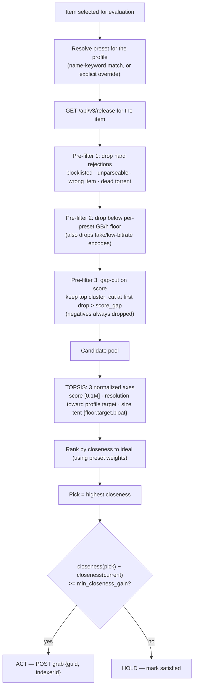
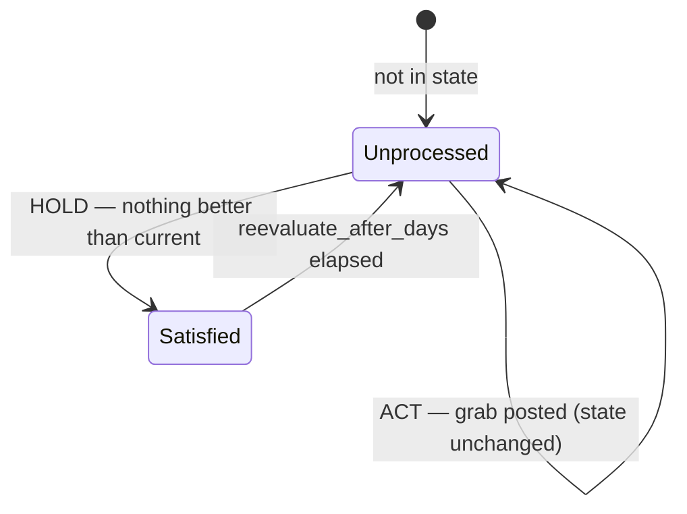

# Optimizarr — Optimizer Design

The optimizer evaluates the releases available for each library item, decides whether a
better one exists (smaller at equal quality, or a genuine quality upgrade), and grabs it
through Radarr/Sonarr. It is built around the reality that **grabbed releases frequently
fail to download** — so "optimized" means *the algorithm can no longer find anything
better than the current file*, never merely *we triggered a grab*.

This document describes two things:

1. **Release evaluation** — how a single item's candidate releases are filtered, scored,
   and turned into an ACT/HOLD decision.
2. **Worker loop** — the continuous, queue-gated process that walks the library, and the
   per-item state lifecycle that makes failure handling self-correcting.

---

## 1. Release evaluation pipeline

For one movie (or episode), this is how candidates become a decision.

### Pipeline notes

- Each profile resolves to a **preset** (Remux/Quality/Balanced/Efficient/Compact, or
  user-defined) via case-insensitive name-keyword matching, with per-profile overrides
  available. The preset bundles both **weights** and a **per-resolution size tent**
  `{floor, target, bloat}`. So Remux's 2160 tent peaks at ~25 GB/h and tolerates remux-scale
  files, while Compact's 2160 tent has `target == floor` (it degenerates to a cost curve so
  the smallest above the fake floor wins).
- The gb/h floor is **per-preset**: it both drops fake/wrong-kind releases AND forms the
  baseline of the tent. n_size rises from floor to target and falls from target to bloat,
  so each preset is "tuned to its own size band" (remux range for Remux, bluray range for
  Quality, lean for Efficient, smallest for Compact).
- Score uses a **fixed** normalization `[score_anti_ideal, score_ideal]` (so good releases
  stay comparable across items). Gap-cut handles *inclusion* only — it never moves the
  anti-ideal up into the cluster (which would over-spread good releases).
- The swap decision is a **single threshold**: grab iff the pick's closeness beats the
  current file's by at least `min_closeness_gain`. Closeness folds score, resolution, and
  size together, so that one check covers both shrinking a bloated file and a real quality
  upgrade. The policy lives in the **preset's weights and size curve** — tuning behavior
  means tuning those.

---

## 2. Worker loop

The optimizer is a continuous interval-driven worker (not a cron pass). The unmonitor
feature keeps its own cron; the optimizer's cadence is governed by its own timers.

### Loop notes

- One **queue fetch per iteration** serves both the pace gate (`queue_max`) and the
  "is this item already downloading?" skip — so there is **no in-flight state** to track,
  and a restart needs no reconciliation.
- `process_interval_seconds` (default 15, minimum 10) is a **settle delay**: after a
  `POST /api/v3/release`, Radarr needs a moment to register the release in the queue.
  Reading too soon would make the next `queue_max` check miss the just-grabbed item.
- A grab **records nothing**. Each picked item is remembered for the current **pass** so
  it isn't re-picked; one pass covers every not-yet-satisfied item, however long that takes.
  A **list refresh does not restart the pass** — it only updates the candidate set (new
  items become pickable, removed ones drop). When the pass is fully covered it resets and a
  new one begins. Satisfied items stay excluded until their reevaluate window elapses, so
  over successive passes the active set keeps shrinking.

---

## 3. Per-item state lifecycle

State lives in `/data/state.json`, keyed by movie id / episode id. It records exactly one
thing — whether an item is **satisfied** — and that minimalism is what makes failure
handling self-correcting, with no in-flight tracking or cooldown timer.

### Why this self-corrects on failure

- A grab is **never recorded**. The only persisted states are *unprocessed* and *satisfied*.
- A grab that **succeeds** replaces the file; on the next evaluation the algorithm sees a
  good current file and returns HOLD → the item becomes **satisfied** and leaves the pool.
- A grab that **fails** was never marked satisfied, so the item stays in the pool. When it's
  picked again, pre-filter 1 drops the now-blocklisted release and TOPSIS picks the
  **next-best** candidate. Repeated failures walk down the ranking, one blocklisted release
  at a time, until one sticks (→ satisfied) or nothing viable remains (HOLD → satisfied).
- A download **in progress** is skipped via live queue membership, never re-grabbed — so the
  "did the grab work?" question is answered implicitly by re-evaluation, not by bookkeeping.

> **Dependency:** this relies on Radarr/Sonarr **Failed Download Handling** being enabled
> (default on) so dead releases get blocklisted. Without it, a failed grab would not be
> de-prioritised on the next pass.
